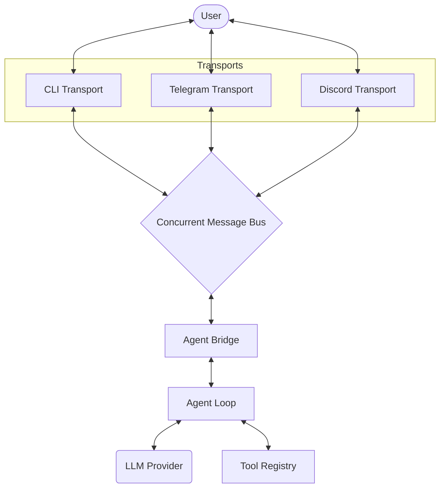

# 🦀 Crabbybot

[](https://www.rust-lang.org/)
[](LICENSE)
[](https://github.com/max-de-bug/crabbybot)

**Crabbybot** 🦀 is an ultra-lightweight, blazing-fast personal AI assistant written in Rust. Inspired by [nanobot](https://github.com/HKUDS/nanobot), it provides a direct, high-performance bridge between your local environment and Large Language Models (LLMs).

## 🚀 Key Features

- **Multi-Channel Support**: Interact via CLI, **Telegram**, or **Discord**.
- **Agent Bridge**: Decoupled architecture using a concurrent `MessageBus`.
- **Tool-Use (Function Calling)**: Capability to read/write files, execute shell commands, and fetch web content.
- **Cron Jobs**: Schedule automated AI tasks using standard cron syntax or intervals.
- **Session Persistence**: Persistent conversation threads scoped to users and channels.
- **Zero Runtime Dependencies**: Just a single binary and a config file.

## 🏗️ Architecture

Crabbybot uses an event-driven architecture centered around an asynchronous message bus.



## 🛠️ Getting Started

### Prerequisites

- [Rust Toolchain](https://rustup.rs/) (Stable)

### Installation

1.  **Clone the repository**:
    ```bash
    git clone https://github.com/max-de-bug/crabbybot.git
    cd crabbybot
    ```

2.  **Build**:
    ```bash
    cargo build --release
    ```

3.  **Onboard**:
    Generate a default configuration:
    ```bash
    ./target/release/crabbybot onboard
    ```

## ⚙️ Configuration

Crabbybot is configured via `~/.crabbybot/config.json`. 

```json
{
  "providers": {
    "openrouter": {
      "apiKey": "YOUR_OPENROUTER_KEY"
    }
  },
  "agents": {
    "defaults": {
      "model": "anthropic/claude-3-5-sonnet",
      "workspace": "~/.crabbybot/workspace"
    }
  },
  "channels": {
    "telegram": {
      "enabled": true,
      "token": "YOUR_TELEGRAM_TOKEN"
    },
    "discord": {
      "enabled": false,
      "token": "YOUR_DISCORD_TOKEN"
    }
  }
}
```

## 🤖 Usage

### Interactive Chat (CLI)
Start a standard interactive session:
```bash
crabbybot chat
```

### Bot Mode (Telegram/Discord)
Run Crabbybot in the background to serve external channels:
```bash
crabbybot bot
```

### Scheduling Jobs
Add a cron job to keep you updated:
```bash
crabbybot cron add --name "Morning Brief" --schedule "0 8 * * *" --message "Summarize the latest AI news."
```

## 📡 Channel Setup

### Telegram
1. Message [@BotFather](https://t.me/botfather) to create a bot and get a token.
2. Enable `telegram` in your `config.json`.
3. Run `crabbybot bot`.

### Discord
1. Create an app on the [Discord Developer Portal](https://discord.com/developers/applications).
2. Add a Bot, enable `Message Content Intent`.
3. Enable `discord` in your `config.json`.
4. Run `crabbybot bot`.

## 🛡️ License

This project is licensed under the MIT License - see the [LICENSE](LICENSE) file for details.

---
*Built with 🦀 by the Crabbybot Team.*
