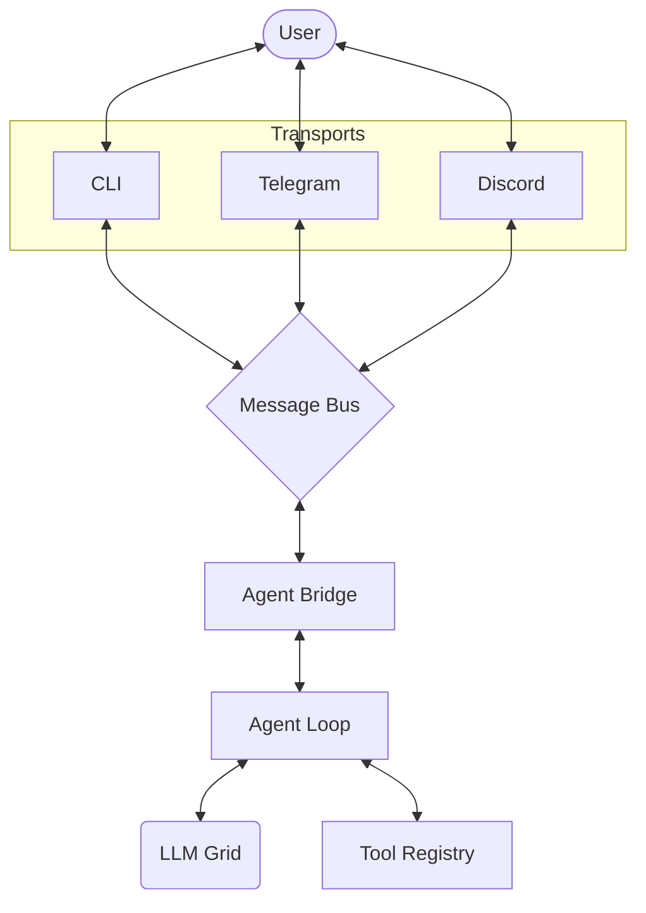

<div>
  <table>
    <tr>
      <td valign="top" width="220">
        
      </td>
      <td valign="top">
        <h1>🦀 Zoidclaw</h1>
        <a href="https://git.io/typing-svg">
          
        </a>
        <br><br>
        <a href="https://www.rust-lang.org/"></a>
        <a href="LICENSE"></a>
        <a href="https://github.com/max-de-bug/zoidclaw"></a>
      </td>
    </tr>
  </table>
</div>

**Zoidclaw** is  a pure Rust AI powerhouse inspired by the best of **nanobot** and **OpenClaw**. Engineered for sub-millisecond execution, it bridges sophisticated LLM logic with the Solana trenches, delivering real-time Pump.fun alerts, automated rug security, and precision trading to your Telegram or CLI.

## 🚀 Key Features

- **⚡ Crypto Native**: First-class support for **Solana** and **Pump.fun**, including real-time alerts, rug detection, and alpha scoring.
- **💬 Multi-Channel**: Native bridges for **Telegram**, **Discord**, and a powerful **CLI**.
- **🎯 Shortcut Commands**: High-velocity slash commands (`/portfolio`, `/alpha`, `/buy`) for instant on-chain interaction.
- **⏰ Proactive Autonomy**: Integrated cron engine for scheduling recurring AI research and monitoring tasks.
- **🛠️ Extensible Tool-Use**: Native capability to execute shell commands, manage files, and fetch live web data.
- **🔐 Session Persistence**: Persistent conversation threads stored locally and securely.
- **🦀 Pure Rust Core**: Zero runtime dependencies and sub-millisecond local routing.

## 🏗️ Architecture

Decoupled, event-driven, and concurrent.



## 🛠️ Deployment

### Prerequisites
- [Rust Toolchain](https://rustup.rs/)

### Build
1. **Clone & Compile**:
    ```bash
    git clone https://github.com/max-de-bug/zoidclaw.git
    cd zoidclaw
    cargo build --release
    ```
2. **Onboard**:
    ```bash
    ./target/release/zoidclaw onboard
    ```

## ⚙️ Configuration

Zoidclaw is configured via `~/.zoidclaw/config.json`. 

```json
{
  "providers": {
    "openrouter": {
      "apiKey": "YOUR_OPENROUTER_KEY"
    }
  },
  "agents": {
    "defaults": {
      "model": "anthropic/claude-3-5-sonnet",
      "workspace": "~/.zoidclaw/workspace"
    }
  },
  "channels": {
    "telegram": {
      "enabled": true,
      "token": "YOUR_TELEGRAM_TOKEN"
    },
    "discord": {
      "enabled": false,
      "token": "YOUR_DISCORD_TOKEN"
    }
  }
}
```

## 🤖 Usage

### Interactive Chat (CLI)
Start a standard interactive session:
```bash
zoidclaw chat
```

### Bot Mode (Telegram/Discord)
Run Zoidclaw in the background to serve external channels:
```bash
zoidclaw bot
```

### Scheduling Jobs
Add a cron job to keep you updated:
```bash
zoidclaw cron add --name "Morning Brief" --schedule "0 8 * * *" --message "Summarize the latest AI news."
```

## 📡 Channel Setup

### Telegram
1. Message [@BotFather](https://t.me/botfather) to create a bot and get a token.
2. Enable `telegram` in your `config.json`.
3. Run `zoidclaw bot`.

### Discord
1. Create an app on the [Discord Developer Portal](https://discord.com/developers/applications).
2. Add a Bot, enable `Message Content Intent`.
3. Enable `discord` in your `config.json`.
4. Run `zoidclaw bot`.

## 🛡️ License

This project is licensed under the MIT License - see the [LICENSE](LICENSE) file for details.

---
*Built with 🦀 for the Solana Ecosystem.*
